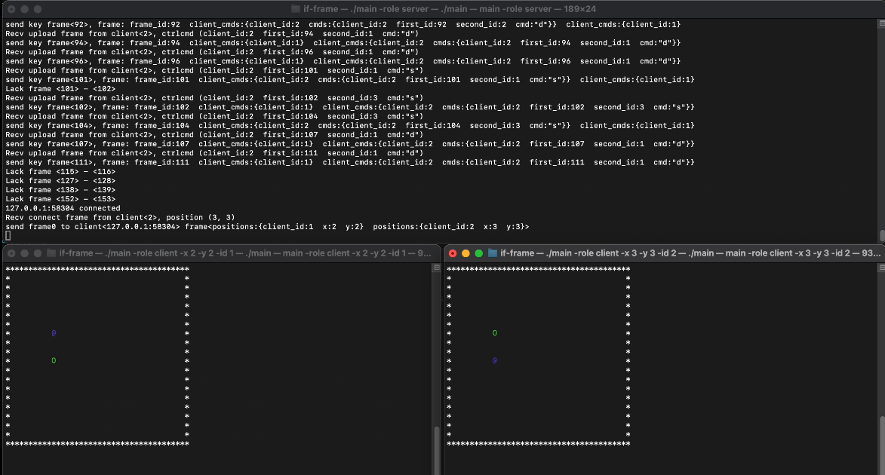
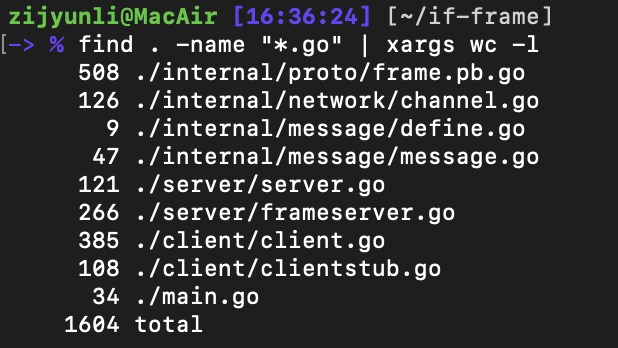

# IF-Frame
Go 语言实现帧同步机制的demo，支持断线重连。

* 视频演示-playdemo.mp4
<video width="320" height="240" controls>
    <source src="./playdemo.mp4" type="video/mp4">
</video>

* 运行环境: macos, go 1.22  


* 运行命令
```bash
# 参数
# -role: 启动角色, server: 服务器, client: 客户端
# -x: 作为客户端启动时的初始 x 坐标
# -y: 作为客户端启动时的初始 y 坐标
# -id: 作为客户端启动时的客户端id

# 服务器启动
./main -role server

# 客户端启动
./main -role client -x 2 -y 2 -id 1
```

* 操作说明
```
    W
A   S   D
为上下左右移动
esc: 退出
```
* 代码量  

